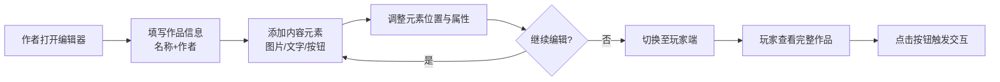

# 产品需求文档 (PRD) - 互动作品编辑器与播放器

## 1. 产品概述
一款面向内容创作者的互动式作品编辑与展示平台，支持作者通过可视化编辑器创建包含图文、交互按钮的互动作品，并在玩家端完整呈现所有创作内容。适用于互动小说、视觉小说、教学课件、故事绘本等场景。

## 2. 核心功能

### 2.1 用户角色
| 角色 | 核心权限 |
|------|----------|
| 作者 | 创建/编辑作品、添加元素（标题、姓名、图片、文字、按钮）、预览发布 |
| 玩家 | 浏览并体验作者发布的完整互动作品 |

### 2.2 功能模块
1. **作者端编辑器**：作品信息设置、画布编辑区、工具面板、元素属性编辑
2. **玩家端播放器**：沉浸式作品展示界面、交互按钮响应、全屏浏览体验

### 2.3 页面详情
| 页面名称 | 模块名称 | 功能描述 |
|-----------|----------|----------|
| 作者端编辑器 | 作品信息栏 | 输入作品名称、作者姓名，支持实时预览 |
| 作者端编辑器 | 元素工具面板 | 提供图片上传、文本输入、按钮添加三种核心元素类型 |
| 作者端编辑器 | 画布编辑区 | 可视化拖拽布局区域，支持元素的自由放置与位置调整 |
| 作者端编辑器 | 属性编辑面板 | 选中元素后可修改其具体属性（按钮文字、文本内容等） |
| 玩家端播放器 | 作品展示区 | 完整呈现作者创建的所有元素（标题、作者、图片、文字、按钮） |
| 玩家端播放器 | 交互响应层 | 按钮点击反馈与交互效果 |

## 3. 核心流程

## 4. 用户界面设计

### 4.1 设计风格
- **主色调**：深邃墨蓝 (#0f172a) 为底，搭配暖金琥珀 (#f59e0b) 作为强调色
- **辅助色**：柔和米白 (#fafaf9) 用于文字，淡青灰 (#94a3b8) 用于次要信息
- **按钮风格**：圆角胶囊形，带有微妙的内阴影和悬浮发光效果
- **字体选择**：标题使用「思源宋体」营造文艺气质，正文使用「Noto Sans SC」保证可读性
- **布局风格**：左右分栏式编辑器布局，玩家端采用居中沉浸式卡片设计
- **整体氛围**：现代书房感 — 温润、专注、有质感的内容创作空间

### 4.2 页面设计概览
| 页面名称 | 模块名称 | UI 设计要素 |
|-----------|----------|-------------|
| 作者端编辑器 | 顶部信息栏 | 毛玻璃效果导航条，左侧Logo区，中间作品名/作者名输入框，右侧模式切换按钮 |
| 作者端编辑器 | 左侧工具面板 | 垂直图标工具栏，深色底板，图标带悬浮高亮动画，包含"添加图片""添加文字""添加按钮"三个核心操作 |
| 作者端编辑器 | 中央画布区 | 点阵网格背景的编辑画布，元素可拖拽定位，选中时显示边框与控制手柄，支持删除操作 |
| 作者端编辑器 | 右侧属性面板 | 动态显示当前选中元素的属性编辑项（图片预览、文本框、按钮文字输入） |
| 玩家端播放器 | 主展示区 | 渐变背景上的居中内容卡片，优雅入场动画，元素按层级依次浮现 |
| 玩家端播放器 | 按钮交互区 | 底部排列的交互按钮，点击时有涟漪扩散动效 |

### 4.3 响应式设计
- 以桌面端为主（1200px+），编辑器采用三栏固定布局
- 平板端（768px-1199px）自适应为上下分层布局
- 移动端（<768px）简化为单栏堆叠，触摸友好的大尺寸控件

## 5. 数据结构概要
- **作品数据**：包含 id、title（作品名称）、author（作者姓名）、elements（元素数组）
- **元素类型**：image（图片）、text（文本）、button（按钮）
- **每个元素**：id、type、x/y坐标、width/height、content（内容/文字/src）、zIndex（层级）
