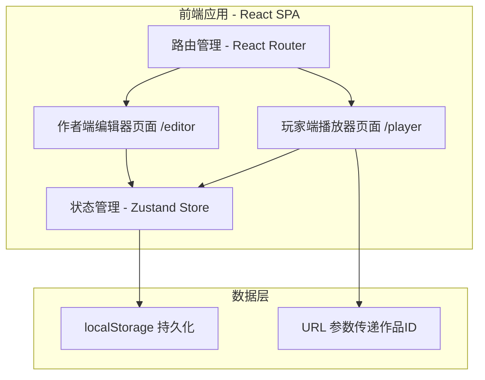
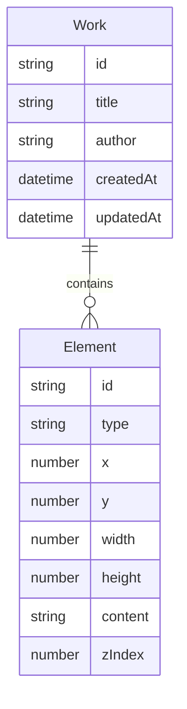
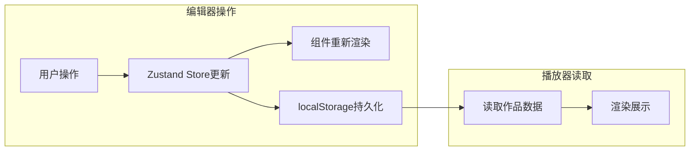

# 技术架构文档 - 互动作品编辑器与播放器

## 1. 架构设计



## 2. 技术选型

| 类别 | 技术方案 | 说明 |
|------|----------|------|
| 前端框架 | React 18 + TypeScript | 组件化开发，类型安全 |
| 构建工具 | Vite 5 | 快速开发与构建 |
| 样式方案 | Tailwind CSS 3 + CSS Modules | 原子化CSS为主，复杂组件用Modules |
| 状态管理 | Zustand | 轻量级状态管理，适合编辑器场景 |
| 路由 | React Router v6 | 编辑器/播放器页面路由切换 |
| 拖拽功能 | @dnd-kit/core + @dnd-kit/sortable | 元素拖拽定位 |
| 数据持久化 | localStorage | 本地存储作品数据，无需后端 |
| 图标库 | Lucide React | 轻量美观的图标库 |
| 字体 | Google Fonts - Noto Serif SC + Noto Sans SC | 中文字体支持 |

## 3. 路由定义

| 路由路径 | 页面 | 用途 |
|----------|------|------|
| `/` | 首页/入口 | 导航到编辑器或选择已有作品 |
| `/editor` | 作者端编辑器 | 可视化编辑作品内容 |
| `/player/:id` | 玩家端播放器 | 展示指定作品的完整内容 |

## 4. 数据模型

### 4.1 数据模型定义



### 4.2 数据类型定义 (TypeScript)

```typescript
// 作品数据结构
interface Work {
  id: string;
  title: string;          // 作品名称
  author: string;         // 作者姓名
  elements: Element[];    // 元素列表
  createdAt: number;      // 创建时间戳
  updatedAt: number;      // 更新时间戳
}

// 元素类型枚举
type ElementType = 'text' | 'image' | 'button';

// 画布元素
interface Element {
  id: string;
  type: ElementType;      // 元素类型
  x: number;              // X坐标位置
  y: number;              // Y坐标位置
  width: number;          // 宽度
  height: number;         // 高度
  content: string;        // 内容（文本内容/图片Base64/按钮文字）
  zIndex: number;         // 层级顺序
  fontSize?: number;      // 文本字号（仅text类型）
  color?: string;         // 文字颜色（仅text/button类型）
}
```

## 5. 组件架构

```
src/
├── App.tsx                    # 路由入口
├── main.tsx                   # 应用入口
├── pages/
│   ├── HomePage.tsx           # 首页 - 作品列表与新建入口
│   ├── EditorPage.tsx         # 作者端编辑器主页面
│   └── PlayerPage.tsx         # 玩家端播放器页面
├── components/
│   ├── editor/
│   │   ├── EditorHeader.tsx   # 编辑器顶部栏（作品名/作者输入）
│   │   ├── ToolPanel.tsx      # 左侧工具面板
│   │   ├── CanvasArea.tsx     # 中央画布编辑区
│   │   ├── PropertyPanel.tsx  # 右侧属性编辑面板
│   │   └── elements/
│   │       ├── TextElement.tsx     # 文本元素组件
│   │       ├── ImageElement.tsx    # 图片元素组件
│   │       └── ButtonElement.tsx   # 按钮元素组件
│   └── player/
│       ├── PlayerHeader.tsx   # 播放器顶部（作品名/作者展示）
│       ├── PlayerCanvas.tsx   # 播放器内容展示区
│       └── elements/
│           ├── PlayerText.tsx      # 玩家端文本渲染
│           ├── PlayerImage.tsx     # 玩家端图片渲染
│           └── PlayerButton.tsx    # 玩家端按钮渲染（可交互）
├── store/
│   └── useWorkStore.ts        # Zustand 全局状态管理
├── types/
│   └── index.ts               # TypeScript 类型定义
└── utils/
    ├── storage.ts             # localStorage 操作工具
    └── idGenerator.ts         # ID生成工具
```

## 6. 核心交互流程

### 6.1 编辑器交互
1. 用户在顶部输入作品名称和作者姓名 → 更新 Store
2. 点击左侧工具面板的"添加"按钮 → 在画布中心创建对应元素
3. 拖拽元素到目标位置 → 更新元素 x/y 坐标
4. 点击元素选中 → 右侧属性面板显示该元素的可编辑属性
5. 修改属性值 → 实时更新画布中的元素显示
6. 所有变更自动保存到 localStorage

### 6.2 数据流转

